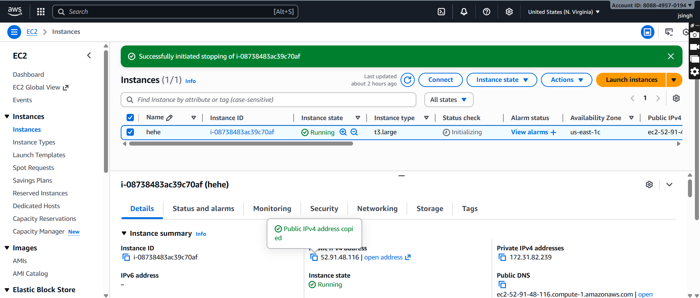
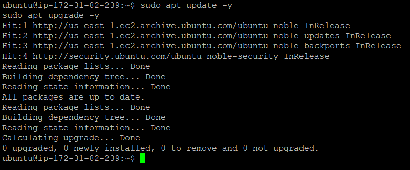
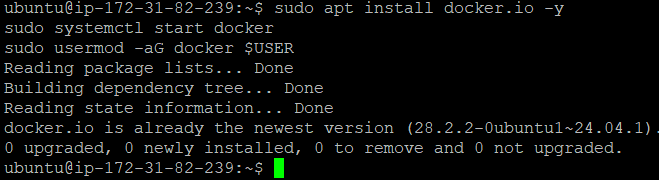
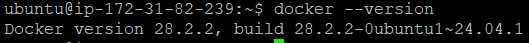
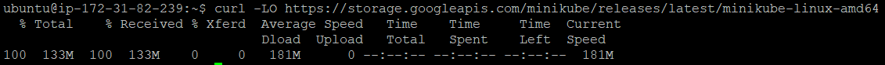
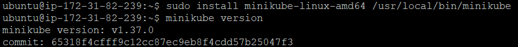
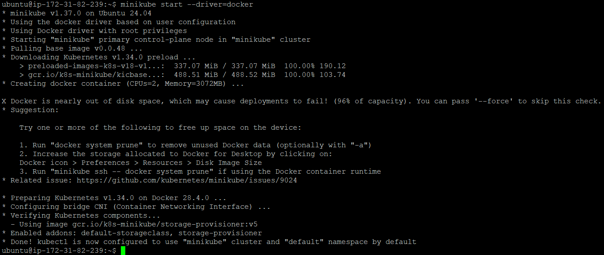
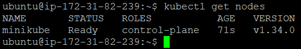

# Minikube-

# Connect to Your EC2 Instance

# Update Your System

# Ensure Docker is Installed and Running

# Download Minikube Binary

# Install Minikube

# Start Minikube

# Verify the Cluster

